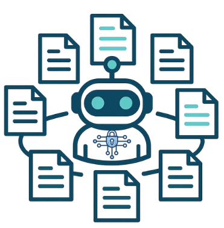

<div align="center">
  
  <h1 align="center">CTIArena: Automatic Cyber Threat Intelligence Knowledge Graph Construction Using Large Language Models</h1>
</div>
<h2> 🔔 Introduction</h2>
<p align="center">
   
</p>

**CTIARENA**, is designed to evaluate LLM performance on heterogeneous, multi-source CTI under knowledge-augmented settings. CTIARENA spans three categories, structured, unstructured, and hybrid, further divided into nine tasks that capture the breadth of CTI analysis in modern security operations. 

## ⚙️ Installation 

### Installation
```bash
# Install all dependencies
pip install -r requirements.txt

# Set up proprietary API keys
export OPENAI_API_KEY="your_openai_api_key"
export GOOGLE_API_KEY="your_google_api_key"
export CLAUDE_API_KEY="your_claude_api_key"
```

## 🔍 Inference

### Static Task
```bash
# Example: Run inference on RCM dataset
python baselines/static/static_baselines.py \
   --task rcm \
   --input-dir datasets/static/RCM \
   --model gpt5 
```

### Dynamic Task
```bash
# Example: Run inference on CSC dataset
python baselines/dynamic/dynamic_baselines.py \
    --input_dir datasets/dynamic/CSC/ \
    --output_dir baselines/dynamic/output \
    --task_type CSC \
    --llm_model gpt5
```

### Hybrid Task
```bash
# Example: Run inference on ATA dataset
python baselines/hybrid/hybrid_baselines.py \
    --dataset datasets/hybrid/ATA \
    --approaches closed_book vanilla_rag rag_expansion \
    --framework mitre
    --model gpt5
```

## ⭐ Evaluation

### Static Task
```bash
# Example: Evaluate on RCM task
python baselines/static/evaluate_results.py \
   --task rcm \
   --folder baselines/static/output/RCM
```

### Dynamic Task
```bash
# Example: Evaluate on CSC task
python baselines/dynamic/evaluate_results.py \
    --folder baselines/dynamic/output/CSC/ \
    --model gpt5
```

### Hybrid Task
```bash
# Example: Evaluate on ATA task
python baselines/hybrid/evaluate_results.py \
    --folder baselines/hybrid/output/ATA/ \
    --model gpt5
```

## 🚧 Dataset
The dataset is currently being refined and will be released soon.  
Stay tuned for updates!